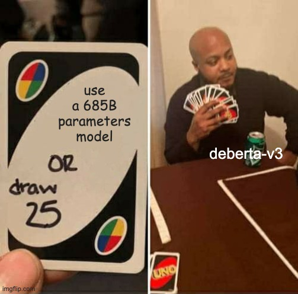
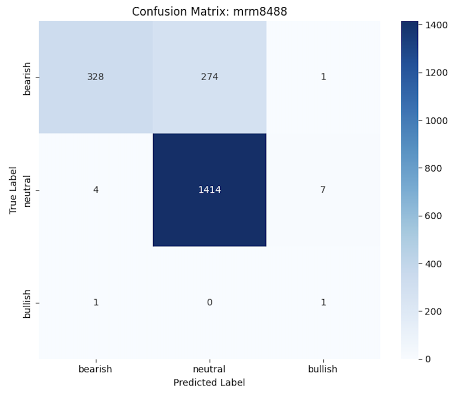
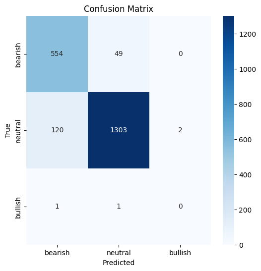

# NLP Finance Project — Sentiment Analysis & Knowledge Distillation

## Overview
This project aims to **benchmark and improve financial text-classification models** on multi-source financial news. Financial sentiment analysis is critical for algorithmic trading and market monitoring, yet labeled datasets are often scarce or noisy.

It completes <https://github.com/ArthurrMrv/graph_project.git> that aims to study the link between news analysis and stock prices in a visual and mathematical manner. Issue being we used an Finbert model. In this project I used a much more recent Bert-3 fine tuned model for finance coupled with home made knowledge distillation to greatly improve its performance (from F1 score of 0.5 to 0.9) on finance sentiment analysis. Then I've implemented an api and front end that enables easy acess or plug into teh main project.

<p align="center">
  
</p>

My approach involves:
1.  **Label Generation**: Using Large Language Models (LLMs) like DeepSeek-V3.2 to generate or standardize labels (`bearish`, `neutral`, `bullish`) for the `financial-news-multisource` dataset.
2.  **Model Benchmarking**: Evaluating pretrained transformer models (specifically DeBERTa-v3 variants) to establish a strong baseline.
3.  **Fine-Tuning**: Fine-tuning the best-performing baseline on a curated dataset to maximize accuracy.
4.  **Knowledge Distillation**: Compressing the fine-tuned "teacher" model into a smaller, faster "student" model suitable for real-time inference without significant performance loss.

This repository contains the research notebooks used for training and analysis, as well as a production-ready Dockerized application for real-time inference.

As seen bellow the before / after confusion matrix reflects a clear improvement in F1 metrics.

<p align="center">
  
  
</p>


## Installation

### Prerequisites
*   **Python 3.12+**
*   **CUDA** (Optional, for GPU acceleration during training)
*   **Docker** (For running the demo application)

### Setup

To set up the development environment locally:

```bash
# Clone the repository
git clone <https://github.com/ArthurrMrv/nlp_final.git>
cd final_project

# Create and activate a virtual environment (optional but recommended)
python -m venv .venv
source .venv/bin/activate  # On Windows: .venv\Scripts\activate

# Install development dependencies
pip install -r research_dev/requirements.txt
```

## Dataset

*   **Name**: `financial-news-multisource`
*   **Source**: [Hugging Face Datasets](https://huggingface.co/datasets/Brianferrell787/financial-news-multisource)
*   **Labels**: The original dataset lacks consistent labels. We utilized **DeepSeek-V3.2** via the Hugging Face Inference API to annotate samples with:
    *   `bearish` (-1 or -2)
    *   `neutral` (0)
    *   `bullish` (+1 or +2)
*   **Size**: ~10k+ samples processed.

To download and process the dataset, refer to the notebook `research_dev/financial_sentiment_analysis.ipynb`.

## Model Architecture

We focused on the **DeBERTa-v3** architecture due to its superior performance on NLU tasks.

*   **Baselines**: 
    *   `nickmuchi/deberta-v3-base-finetuned-finance-text-classification`
    *   `mrm8488/deberta-v3-ft-financial-news-sentiment-analysis`
*   **Fine-tuned Model**: `ArthurMrv/deberta-v3-ft-financial-news-sentiment-analysis-finetuned`
    *   Input: Financial news text (max 512 tokens).
    *   Output: Sentiment logits/probabilities.

## Training

Training and fine-tuning experiments are contained within the Jupyter notebooks in the `research_dev/` directory.

To run the fine-tuning workflow:

```bash
# Navigate to the research directory
cd research_dev

# Launch Jupyter Notebook
jupyter notebook fine_tune_model.ipynb
```

*The notebook handles data loading, tokenization, training using the Hugging Face `Trainer` API, and saving the best checkpoint.*

## Evaluation

We evaluate models using the following metrics:
*   **Accuracy**: Overall correctness of sentiment prediction.
*   **Macro F1-Score**: To ensure balanced performance across classes (Bearish/Neutral/Bullish), especially given the potential for class imbalance in financial news.
*   **Confusion Matrix**: To analyze specific misclassifications (e.g., confusing Bearish for Neutral).

Results showed that the fine-tuned model significantly outperformed off-the-shelf baselines on the specific vocabulary and style of the source dataset.

## Demo

We provide a **FastAPI** backend with a simple HTML/JS frontend to demonstrate the model's capabilities.

### Running Locally

```bash
cd app

# Install app dependencies
pip install -r requirements.txt

# Start the server
python main.py
# OR
uvicorn main:app --host 0.0.0.0 --port 8000
```

Access the demo at `http://localhost:8000`.

## Docker

The application is containerized for easy deployment.

### Build and Run

1.  **Build the image:**
    ```bash
    cd app
    docker build -t financial-sentiment-app .
    ```

2.  **Run the container:**
    *   Ensure you have a `.env` file in the `app/` directory with your `HF_TOKEN`.
    
    ```bash
    docker run -p 8000:8000 --env-file .env financial-sentiment-app
    ```

3.  Open your browser to `http://localhost:8000`.

## Project Structure

```
.
├── app/                        # Production Application
│   ├── static/                 # Frontend assets (HTML, CSS, JS)
│   ├── Dockerfile              # Docker configuration
│   ├── main.py                 # FastAPI server & Model Inference
│   ├── requirements.txt        # App dependencies
│   └── .env                    # Environment variables (API Keys)
├── research_dev/               # Research & Development
│   ├── financial_sentiment_analysis.ipynb # Initial data analysis & labeling
│   ├── fine_tune_model.ipynb   # Model fine-tuning workflow
│   ├── init_hg.ipynb           # Hugging Face setup
│   ├── requirements.txt        # Research dependencies
│   └── README.md               # Research specific notes
└── README.md                   # Project documentation
```

## Future Work

With more time and resources, we plan to:
1.  **Complete Knowledge Distillation**: Finish the pipeline to distill the fine-tuned DeBERTa model (Teacher) into a smaller DistilBERT or TinyBERT (Student) for ultra-low latency.
2.  **Expanded Dataset**: Incorporate data from Twitter/X and Reddit (`cashtags`) to improve robustness on informal financial text.
3.  **Real-time Pipeline**: Connect the `app` to a live financial news feed (e.g., Bloomberg or Reuters API) for real-time sentiment monitoring.

## References

*   **DeBERTaV3**: *DeBERTaV3: Improving DeBERTa using ELECTRA-Style Pre-Training with Gradient-Disentangled Embedding Sharing* (He et al., 2021).
*   **Hugging Face**: Transformers Library & Datasets.
*   **DeepSeek**: Used for generating high-quality silver labels for training data.
